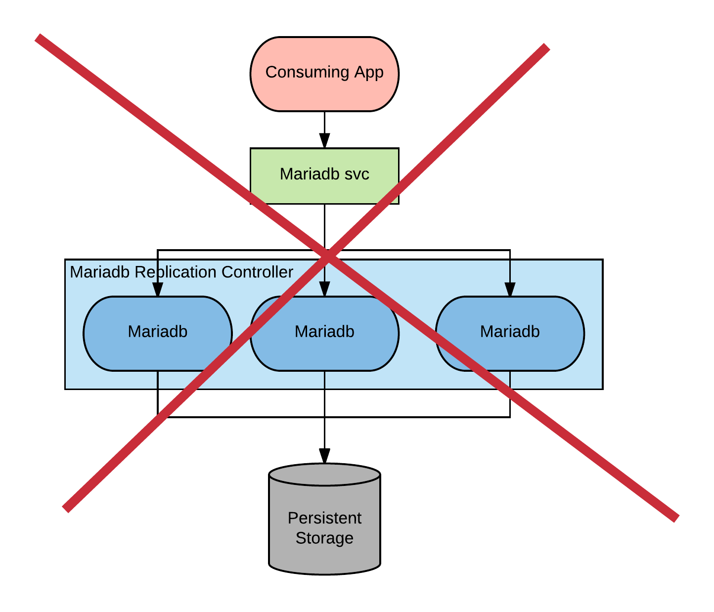
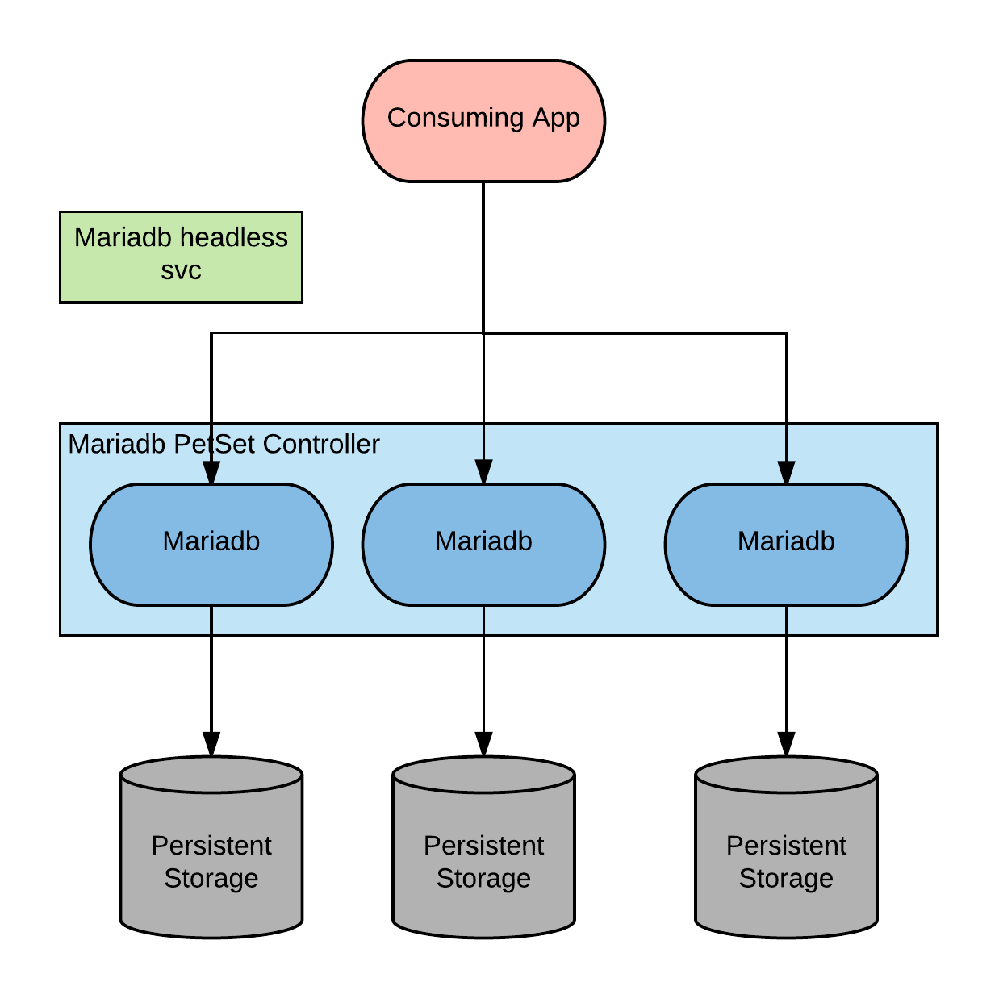

# MySQL HA

This project shows how to build a mysql HA implementation in OpenShift.
We will use the mariadb form of MySQL and the galera project now part of mariadb.

If we try to scale mariadb instances with a replication controller in order to achieve HA we get in the state shown in the below image. 



This mode of operation, where multiple instances of mariadb share the same storage is not supported and will not work.

Mariadb offers several approaches to achieving high availability.

What we are going to use in this demo is a multi-master approach with realtime replication.

Multiple mariadb instances are active at the same time in read/write mode and each has its own storage.
They coordinate to keep the storages in synch.

This feature is provided by galera.

The client can connect to either instances or all of them if it is managing a connection pool.

This architecture can be implemented in OpenShift with PetSet.

The following diagram represent this approach.



Note: This project uses PetSets currently not in tech preview (i.e. not supported) in OpenShift.

## create the mariadb ha cluster in OpenShift

Create a project

```
oc new-project mariadb-ha
```
Create a new build with the maria db image

```
oc new-build https://github.com/raffaelespazzoli/containers-quickstarts#mariadb-ha --strategy=docker --context-dir=mariadb-ha --name=mariadb-ha
```
or using a binary build:
```
oc new-build --name=mariadb-ha --strategy=docker --binary=true
oc start-build mariadb-ha --from-dir=.
```
Grant the default account edit privileges
```
oc policy add-role-to-user edit system:serviceaccount:mariadb-ha:default
```
Deploy the mariadb in ha
```
oc create -f https://raw.githubusercontent.com/raffaelespazzoli/containers-quickstarts/mariadb-ha/mariadb-ha/mariadb-petset.yaml
```
If needed here is how you scale a petset:
```
oc patch petset mariadb-ha -p '{"spec":{"replicas":3}}'
```

## Install a sample app to use the db

Install the todolist app
```
oc new-app openshift/jboss-eap70-openshift~https://github.com/raffaelespazzoli/openshift-quickstarts --context-dir=todolist/todolist-jdbc --name=todolist -e MYDB=java:jboss/jdbc/TodoListDS -e OPENSHIFT_KUBE_PING_NAMESPACE=mariadb-ha
oc expose service todolist
```
Add resource limits and requests to the pod
```
oc patch dc/todolist -p '{ "spec": { "template": { "spec": { "containers": [ { "name": "todolist", "resources": { "limits": { "memory": "1024Mi", "cpu": "500m" }, "requests": { "memory": "512Mi", "cpu": "200m" } } } ] } } } }'
```
Add the autoscaling configuration
```
oc autoscale dc/todolist --min=2 --max=5 --cpu-percent=80
```

## Generate load on the app

Create the load generator
```
oc adm policy add-scc-to-user anyuid system:serviceaccount:mariadb-ha:default
oc create configmap test-file --from-file=./locustfile.py
oc new-app hakobera/locust -e LOCUST_MODE=master -e TARGET_URL=http://todolist:8080 SCENARIO_FILE=/test/locustfile.py --name=locust
oc volume dc/locust --add -m /test --configmap-name=test-file
oc new-app hakobera/locust -e LOCUST_MODE=slave -e TARGET_URL=http://todolist:8080 SCENARIO_FILE=/test/locustfile.py -e MASTER_HOST=locust --name=locust-slave
oc volume dc/locust-slave --add -m /test --configmap-name=test-file
oc scale dc/locust-slave --replicas=3
oc expose service locust --port=8089
```
go to the locust ui and generate some load. If you generate enough load the app should scale. You may increase the number of slave instances to be able to generate even more load. 

## Use chaos monkey to kill the db pods
Create the chaos monkey.
```
oc create -f https://raw.githubusercontent.com/raffaelespazzoli/containers-quickstarts/mariadb-ha/mariadb-ha/chaos-monkey-2.2.149.json
oc new-app chaos-monkey --name=chaos-monkey --param='CHAOS_MONKEY_INCLUDES=mariadb-ha-*' --param='CHAOS_MONKEY_KILL_FREQUENCY_SECONDS=120'
```
This chaos monkey will kill one of the mariadh-ha pod every 2 minutes.
